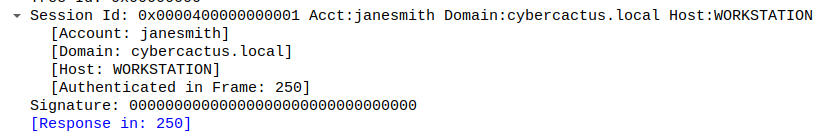
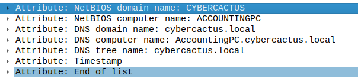

# Summary

Your organization's security team has detected a surge in suspicious network activity. There are concerns that LLMNR (Link-Local Multicast Name Resolution) and NBT-NS (NetBIOS Name Service) poisoning attacks may be occurring within your network. These attacks are known for exploiting these protocols to intercept network traffic and potentially compromise user credentials. Your task is to investigate the network logs and examine captured network traffic.

## Q1 - In the context of the incident described in the scenario, the attacker initiated their actions by taking advantage of benign network traffic from legitimate machines. Can you identify the specific mistyped query made by the machine with the IP address 192.168.232.162?

Filtering on the source IP, I found some packets related to [LLMNR](https://datatracker.ietf.org/doc/html/rfc4795) (As defined in the summary). In this packet, the query made by this address is `fileshaare` (A typo indeed)

## Q2 - We are investigating a network security incident. For a thorough investigation, we need to determine the IP address of the rogue machine. What is the IP address of the machine acting as the rogue entity?

The IP address of the rogue machine responding to `fileshaare.local` is likely related to the LLMNR response pointing to 192.168.232.215. (as seen in the packet 55)

## Q3 - During our investigation, it's crucial to identify all affected machines. What is the IP address of the second machine that received poisoned responses from the rogue machine?

Filtering with LLMNR response, I observed that another response has been sent to the IP 192.168.232.176 with another typo (`prinert` instead of `printer` I guess)

## Q4 - We suspect that user accounts may have been compromised. To assess this, we must determine the username associated with the compromised account. What is the username of the account that the attacker compromised?

Filtering on the second attack vector (192.168.232.176), I found some NTLMSSP_AUTH packet requesting a ticket for the user `janesmith`.

## Q5 - As part of our investigation, we aim to understand the extent of the attacker's activities. What is the hostname of the machine that the attacker accessed via SMB?

On the same packet, I looked at the SMB information provided when a NTLM request is made and I found the following information :

Following the DNS computer name, I see that the infected workstation is named `AccountingPC`.